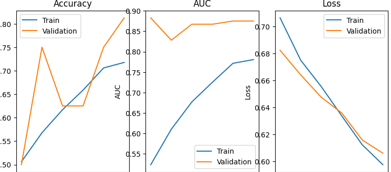

# 🩺 Adaptive Medical Image Enhancement and Diagnosis

**Using Machine Learning, Deep Learning, and Reinforcement Learning**

---

## 📌 Overview
This project focuses on developing an **intelligent adaptive medical image enhancement and diagnostic system** that leverages:

- **Machine Learning (ML)**
- **Deep Learning (DL)**
- **Reinforcement Learning (RL)**

to improve medical image clarity and aid in early, accurate disease detection.

The system dynamically adjusts enhancement parameters based on image characteristics, ensuring optimal visibility for diagnostic regions of interest.  
It integrates automated **disease detection** pipelines for conditions like **Pneumonia** and **COVID-19**, using state-of-the-art AI models.

---
## 🚀 Key Features
✅ **Adaptive Image Enhancement** – RL-driven selection of optimal preprocessing filters & contrast levels  
✅ **Multi-Modal Support** – Works with X-ray, MRI, CT, and ultrasound images  
✅ **Automated Disease Detection** – CNN-based models for fast & accurate diagnosis  
✅ **Explainable AI** – Heatmaps and attention maps highlight suspicious regions  
✅ **Scalable Architecture** – Easily integratable into PACS/Hospital systems  
---
## 🧠 Methodology

The system follows a step-by-step :

1. **Input Image**  
   → Acquired from medical imaging sources (X-ray, MRI, CT, Ultrasound, etc.)

2. **ML Preprocessing & Feature Extraction**  
   → Machine Learning techniques are applied for noise reduction, contrast adjustment, and extracting important features.

3. **DL Segmentation & Initial Diagnosis**  
   → Deep Learning models segment regions of interest (e.g., lungs) and perform an initial classification.

4. **RL Agent Enhances Image**  
   → A Reinforcement Learning agent dynamically adjusts enhancement parameters (contrast, brightness, filters) for optimal diagnostic clarity.

5. **DL Final Diagnosis on Enhanced Image**  
   → Deep Learning models re-analyze the enhanced image for a more accurate diagnosis.

6. **Results + Enhanced Images + Reports**  
   → Final output includes the diagnosis, enhanced images, and structured reports for clinicians.

---

## 🩺 Example Application – Pneumonia & COVID-19 Detection from Lung X-rays

### 🔍 Process:
- **Enhance Lung X-ray Clarity** → Improves contrast & reduces noise  
- **Highlight Disease Regions** → Marks pneumonia opacities / COVID-19 patterns  
- **Boost Diagnostic Accuracy** → CNN models trained on enhanced images  
- **Assist Radiologists** → Reduces interpretation time & improves confidence  

---

## 📊 Results

### Confusion Matrix

### Training & Validation Metrics

### Sample X-ray Images

---

## 📂 Tech Stack
- **Machine Learning** → Scikit-learn, XGBoost  
- **Deep Learning** → TensorFlow / PyTorch (ResNet, DenseNet, U-Net)  
- **Reinforcement Learning** → Stable-Baselines3 (DQN, PPO)  
- **Image Processing** → OpenCV, scikit-image  
- **Web Deployment** → Flask (optional)  
- **Visualization** → Matplotlib, Plotly  

---

## 🛠 Workflow
1. **Image Acquisition** → Raw medical images (X-ray/MRI/CT/Ultrasound)  
2. **Adaptive Enhancement** → RL agent selects optimal enhancement parameters  
3. **Segmentation & Feature Extraction** → DL models extract ROI  
4. **Classification** → Detect & classify diseases  
5. **Visualization** → Generate heatmaps for explainability  
6. **Deployment** → API / Web App integration  

---

## 🔬 Potential Applications
1. Lung X-ray enhancement for pneumonia & COVID-19  
2. Brain MRI tumor detection  
3. Retinal image enhancement (diabetic retinopathy)  
4. Breast mammogram enhancement (early cancer detection)  
5. CT lung nodule detection  
6. Orthopedic fracture detection  
7. Ultrasound fetal anomaly detection  
8. Skin lesion enhancement (melanoma diagnosis)  
9. Dental cavity detection  
10. Cardiac MRI enhancement  
11. Endoscopy image enhancement (polyp detection)  
12. Histopathology image clarity improvement  
13. PET scan enhancement (Alzheimer’s detection)  
14. Portable device integration for rural healthcare  

---

## 🤝 Contributions
Contributions are welcome!  
For major changes, please open an issue first to discuss your ideas.

---

## 📧 Contact
**KISHORE S**  
📩 Email: kishore37386669@gmail.com  
